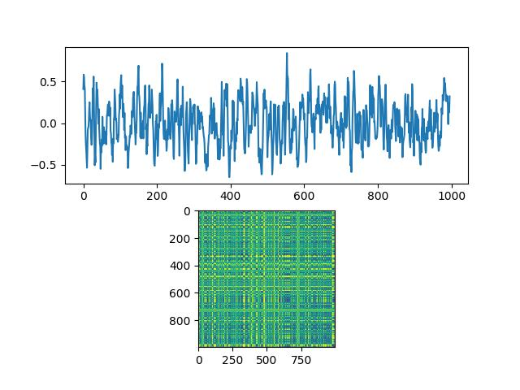

# recurrence-plot-py
[Recurrence plot](http://www.recurrence-plot.tk/glance.php#:~:text=Recurrence%20plot%20%E2%80%93%20A%20recurrence%20plot,a%20certain%20pair%20of%20times).) – A recurrence plot (RP) is an advanced technique of nonlinear data analysis. It is a visualisation (or a graph) of a square matrix, in which the matrix elements correspond to those times at which a state of a dynamical system recurs (columns and rows correspond then to a certain pair of times).

# Result

