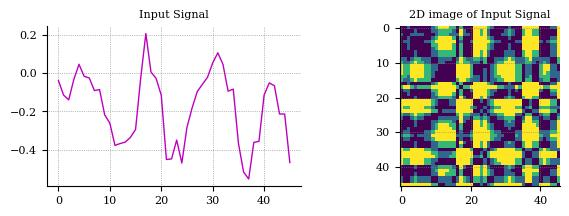

# Recurrence Plot
[Recurrence Plot](https://en.wikipedia.org/wiki/Recurrence_plot) – A recurrence plot (RP) is an advanced technique of **nonlinear** data analysis. It is a visualisation (or a graph) of a square matrix, in which the matrix elements correspond to those times at which a state of a dynamical system recurs (columns and rows correspond then to a certain pair of times).

# Result

# Usage
**1. Install requirements:**

    pip install -r requirements.txt

**2. Run `main.py` script:**

    python3 main.py
